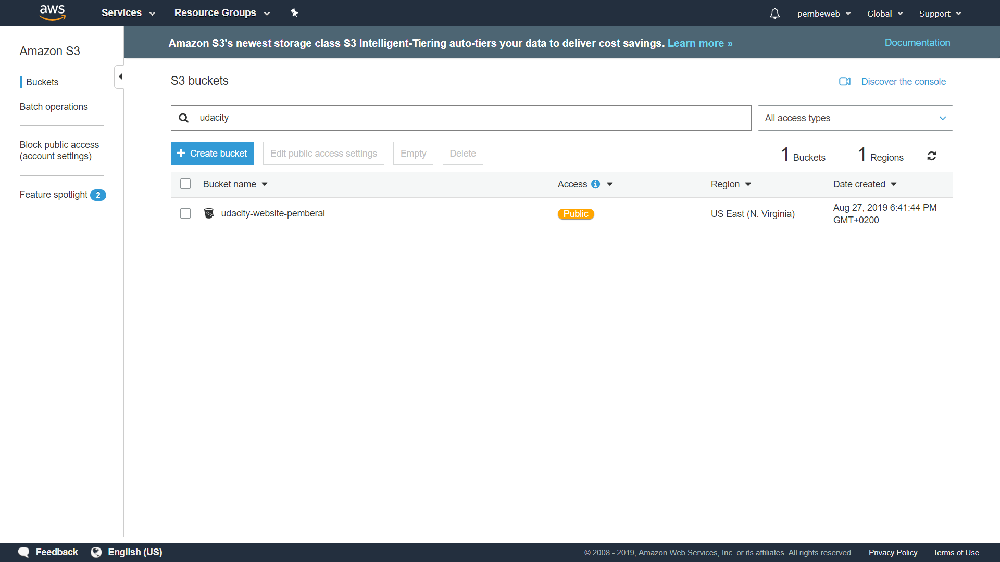
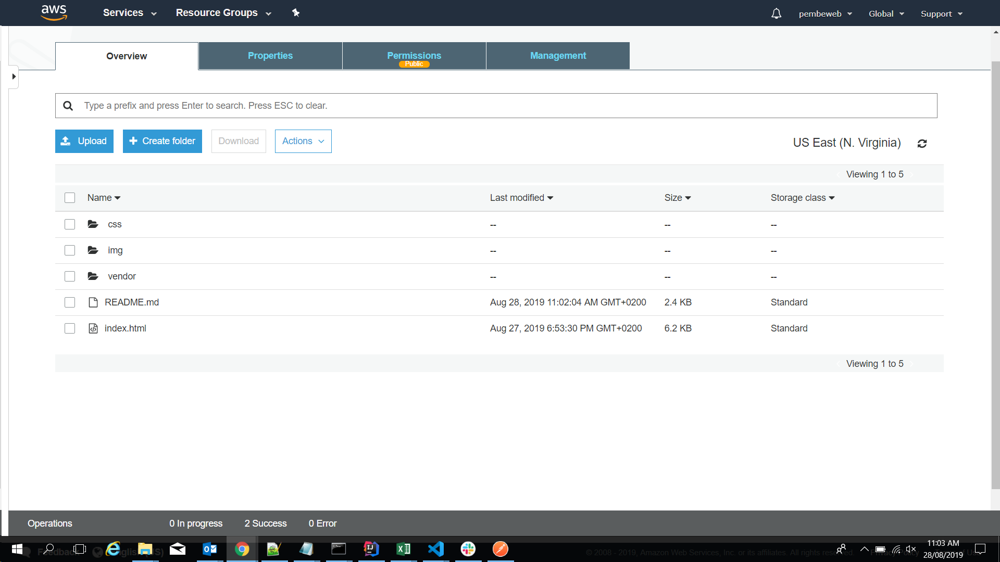
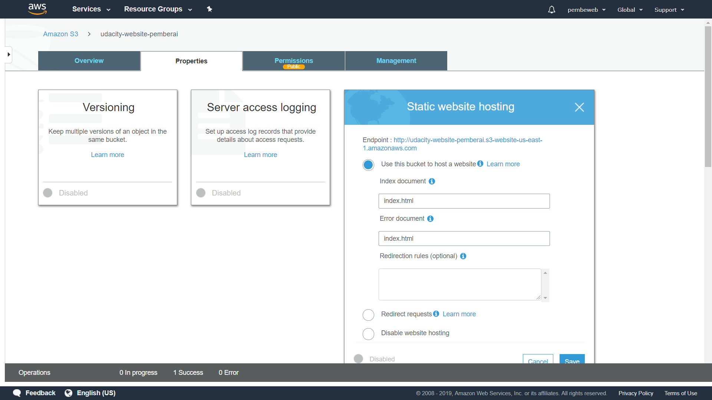
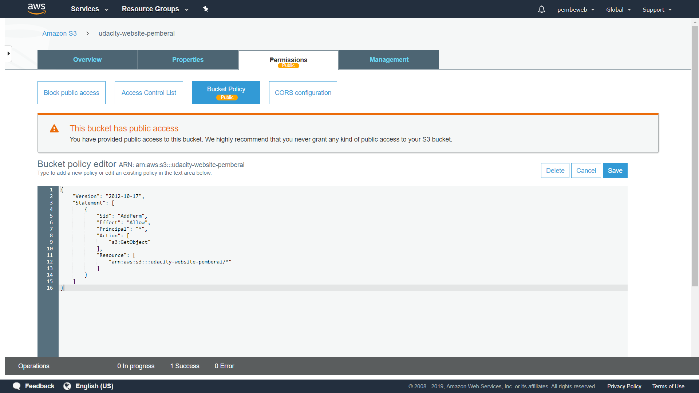
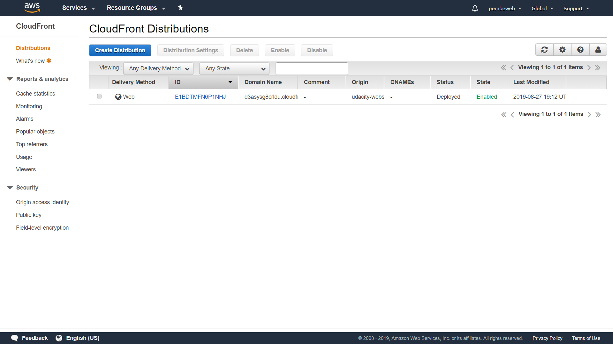
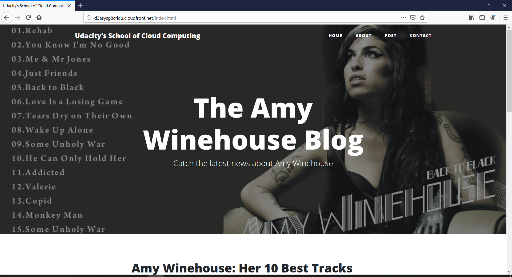

# Deploy Static Website on AWS

> This project demonstrates how to deploy a static website to AWS.

The cloud is perfect for hosting static websites that only include HTML, CSS, and JavaScript files that require no server-side processing. This project demonstrates how to deploy a static website to AWS. The first step is to create a S3 bucket and upload the website files to your bucket. Next is to configure the bucket for website hosting and secure it using IAM policies. Afterwards, to speed up content delivery using AWS’ content distribution network service, CloudFront is used. Lastly, the website can then be accessed in a browser using the unique CloudFront endpoint.

## Website Files Criteria

### The S3 bucket is visible in the AWS Management console.
 

### All website files should be added to the S3 bucket.
 

### The bucket configuration should be set up to support static website hosting.
 

### The permission access to the bucket should be configured to allow public access.
 

## Website Distribution Criteria

### The website should be distributed via Cloudfront.
 

## Web Browser Access Criteria

### Is the website publicly accessible?
 

* **Website URL:** http://d3asysg8crldu.cloudfront.net/index.html

## Built With

* [Amazon Web Services S3](https://aws.amazon.com/s3/) - Resource hosting and deployments
* [AWS CloudFront](https://aws.amazon.com/cloudfront/) - CDN for SPA

## Authors

* **[Pemberai Sweto](https://github.com/thepembeweb)** - *Initial work* - [Item Catalog](https://github.com/thepembeweb/aws-static-website-deployment)

## License

- This project is licensed under the MIT License - see the [LICENSE.md](LICENSE.md) file for details
- Copyright 2019 © [Pemberai Sweto](https://github.com/thepembeweb).
